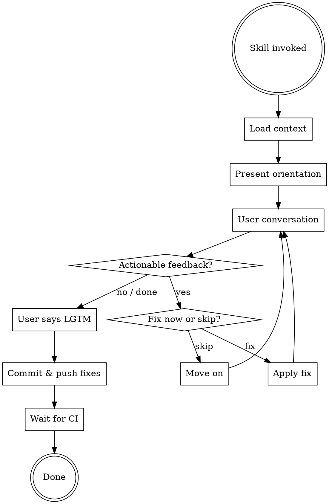

# Final Review

Conversational final review before merging a PR. Bootstrap all relevant context from scratch, present a brief orientation, then open the floor for the user to ask questions, raise concerns, give feedback, and request changes.

## When to Use

- After the full development cycle: research -> design -> plan -> implementation -> AI code reviews -> PR created -> CI green
- Always in a **fresh session** -- no prior context assumed

## Process



### Phase 1: Context Loading

Bootstrap everything before presenting anything to the user.

**1a. Identify branch and PR** (run in parallel):

```bash
git branch --show-current
gh pr view --json title,body,url,number,state,headRefName,baseRefName
git log main..HEAD --oneline
git diff main...HEAD --stat
git diff main...HEAD
```

**1b. Locate artifacts:**

1. **Convention-based** -- parse branch name for a feature identifier (e.g., `feat/auth-user-lifecycle` -> `auth`). Search case-insensitively:
   - `.plan/{matching-dir}/design.md` and `plan.md`
   - `.research/{matching-dir}/`
2. **PR-based** -- scan the PR body for links or references to `.plan/`, `.research/`, or design docs
3. **If nothing found confidently** -> ask the user before proceeding

**1c. Study the changes and read found artifacts:**

Read and understand the full diff from 1a -- every changed file, every hunk. Skip generated or noisy artifacts that don't help follow the logic (e.g., lock files, migration `_snapshot.json` files, auto-generated schema dumps). Then read everything found in 1b -- design docs, plan docs, research summaries. The diff is the primary source of truth; artifacts provide the intent behind the changes.

### Phase 2: Orientation Summary

Present a brief, scannable summary. The user already knows what the changes are about -- this just confirms shared understanding.

Format:

```
**Branch:** `{branch-name}`
**PR:** #{number} -- {title}
**Scope:** {X files changed, Y commits}
**Artifacts found:** {list of design/plan/research docs located, or "none"}

{2-3 sentence description of what the changes do}

Ready for your questions. When everything looks good, type **LGTM** to wrap up.
```

### Phase 3: The Conversation

Open-ended back-and-forth driven by the user.

**Role:**
- Answer questions about the implementation -- reference loaded artifacts and code to explain decisions
- Receive feedback and concerns
- When feedback is actionable, ask: **"Fix now or skip?"**
  - **Fix now** -> apply the change, show what was done
  - **Skip** -> move on, not critical enough to block the merge
- If something can't be determined from loaded context, say so rather than guessing

### Phase 4: The LGTM Sequence

When the user types **LGTM** (case-insensitive), execute the wrap-up:

**Step 1 -- Commit & push:**
- If any fixes were applied during the conversation, stage and commit them (atomic commits per fix, or grouped if they're related)
- `git push`
- If no fixes were made, skip to Step 2

**Step 2 -- Wait for CI:**

```bash
gh pr checks --watch
```

- If all checks pass -> confirm to the user, print the PR URL. Done.
- If a check fails:
  - **Trivial failure** (lint, formatting, type error) -> auto-fix, commit, push, loop back to waiting
  - **Behavioral change required** -> pause and present the issue to the user for approval before fixing

The PR is now ready for the user to merge at their discretion.
