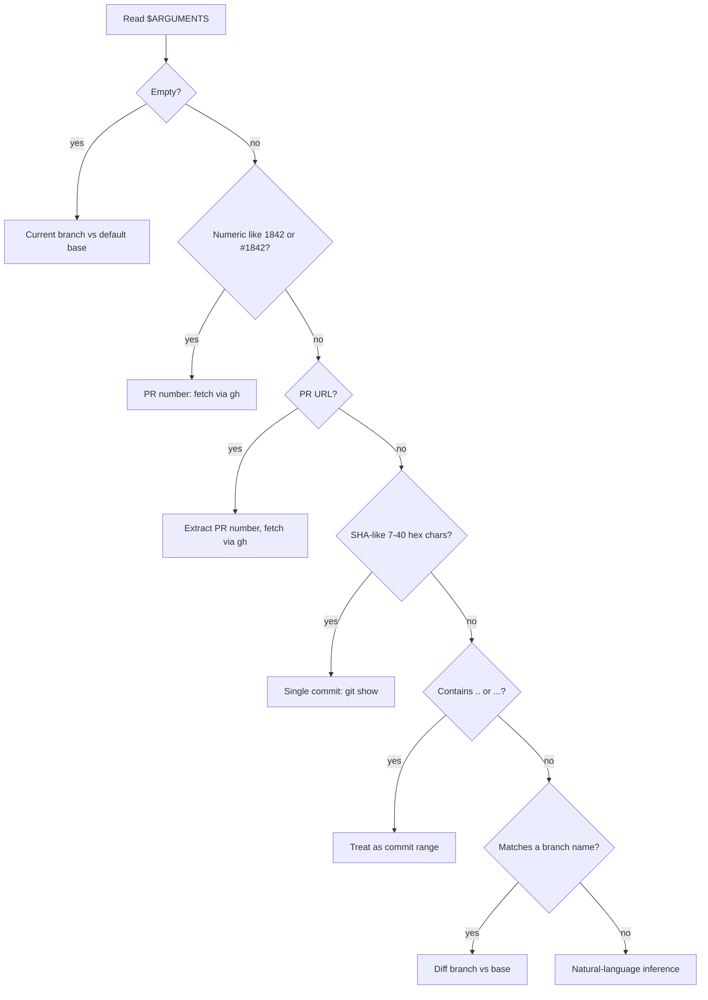

# Prime Review

Prepare a human reviewer to do a thoughtful code review. This skill is **/unpack for code changes**: same layered elaboration, same diagrams-first bias, same "open in review pane" output -- specialized to a change set (PR / branch / commit range / commit) and capped with a short numbered review sequence.

If you only remember three things:

1. **Reuse /unpack's playbook.** Layered Elaboration (TL;DR -> Mental Model -> Walkthrough -> Gotchas), diagrams over prose where they explain better, hybrid annotated diagrams + short prose.
2. **Mermaid must render.** Follow the [Mermaid Safety Rules](#mermaid-safety-rules) below. A diagram that errors out is worse than no diagram.
3. **"How to Review" is short.** A numbered sequence of steps -- not a per-file checklist, not the PERFECT pyramid spelled out for every group.

## Output

Write the brief to a markdown file, then open it for review.

### Output path

- **Default:** `/tmp/prime-review/{sensible-name}.md` -- derive the name from the change's identity (PR number, branch slug, ticket key). Examples: `pr-1842.md`, `feat-auth-lifecycle.md`, `eng-3107-rate-limit.md`. Keep it short, lowercase, kebab-case.
- **Explicit save:** If the user passes `--save <path>`, write there instead.

Create the `/tmp/prime-review/` directory if it doesn't exist.

### After writing

Open the file using `review-doc`:

```bash
CLAUDE_TTY=$(ps -o tty= -p $PPID | tr -d ' ')
CLAUDE_PANE=$(tmux list-panes -s -F '#{pane_id} #{pane_tty}' | grep "$CLAUDE_TTY" | awk '{print $1}')
review-doc --source-pane "$CLAUDE_PANE" <file-path>
```

**Do NOT duplicate the brief to the terminal.** Print one status line, e.g.: `Wrote review primer to /tmp/prime-review/pr-1842.md -- opening for review.`

## Argument Parsing

Resolve `$ARGUMENTS` to a concrete change set before doing anything else. Try structured forms first (cheap, deterministic), then fall back to natural-language inference, and only ask the user as a last resort.

### No args -> branch vs base

`/prime-review` with **no arguments** means: diff the **current branch against the default base branch** (e.g. `main` or `master`). This is the most common case -- the user is about to review their own work or has just checked out someone else's branch.

```bash
base=$(gh repo view --json defaultBranchRef --jq .defaultBranchRef.name 2>/dev/null \
  || git symbolic-ref --short refs/remotes/origin/HEAD 2>/dev/null | sed 's@^origin/@@' \
  || echo main)
branch=$(git rev-parse --abbrev-ref HEAD)
```

If `branch == base`, fall back to "last commit" (`HEAD~1..HEAD`) and note it in the brief.

### Structured forms (try first, in order)



Also scan for `--save <path>` and `--base <ref>` flags before running the resolver.

### Natural-language inference

If `$ARGUMENTS` is free text, map it to a concrete `git`/`gh` invocation. Resolve the **change set** before drafting -- if you can't, ask one targeted question; never guess silently.

| User says | Resolves to |
|-----------|-------------|
| "the last commit" / "latest commit" / "most recent commit" | `HEAD~1..HEAD` |
| "the last N commits" / "last N" / "previous N commits" | `HEAD~N..HEAD` |
| "uncommitted" / "working tree" / "what I haven't committed" | `git diff` (working tree vs HEAD) plus `git diff --staged` |
| "staged" / "what's staged" | `git diff --staged` |
| "today" / "today's changes" / "since this morning" | `git log --since=midnight` -> use commit range from oldest matching commit to HEAD |
| "since yesterday" / "in the last day" | `--since='1 day ago'` |
| "this week" / "since Monday" | `--since='last monday'` (or appropriate `--since`) |
| "since {date}" / "since the {weekday}" | `--since=<resolved>` |
| "my changes" / "my commits on this branch" | `git log <base>..HEAD --author=$(git config user.email)` |
| "since I branched" / "this branch" / "my branch" | current branch vs default base (same as no-args) |
| "the merge commit X" / "merge X" | `git show <sha> -m --first-parent` |
| "{branch} vs {other}" / "compared to {ref}" | `<other>...<branch>` |
| "PR for X" / "the auth PR" | `gh pr list --search "X"` -> pick best match, confirm if ambiguous |

For "today" / "since X" / "my commits" style queries, **convert the resolved log to a concrete commit range** before reading the diff -- diffs over time-filtered logs lose changes outside the matched commits' boundaries. Concretely:

```bash
oldest=$(git log --since='<resolved>' --reverse --pretty=%H | head -n1)
range="${oldest}^..HEAD"
```

If the natural-language phrase is genuinely ambiguous (e.g. "the API changes"), ask **one** targeted question with 2-3 concrete options, then proceed.

### Examples

- `/prime-review` -- current branch vs default base
- `/prime-review 1842` -- PR number
- `/prime-review https://github.com/org/repo/pull/1842` -- PR URL
- `/prime-review abc123f` -- single commit
- `/prime-review main..HEAD` or `main...feature-x` -- commit range
- `/prime-review feat/auth-lifecycle` -- branch
- `/prime-review the last 3 commits` -> `HEAD~3..HEAD`
- `/prime-review today's changes` -> oldest-since-midnight..HEAD
- `/prime-review what I have staged` -> `git diff --staged`
- `/prime-review my changes on this branch` -> `<base>..HEAD --author=<me>`
- `/prime-review --save docs/reviews/auth.md feat/auth-lifecycle`

## Phase 1: Bootstrap Context

Before drafting anything, gather raw material. Run independent commands in parallel.

### 1a. Identify the change set

Pick the right invocation for the resolved form from "Argument Parsing":

```bash
# PR number / URL
gh pr view <num> --json title,body,url,number,state,headRefName,baseRefName,author,labels
gh pr diff <num>

# Branch (vs base) -- also the no-args default
git diff <base>...<branch> --stat
git diff <base>...<branch>
git log <base>..<branch> --pretty=format:'%h %s%n%b%n---'

# Commit range (covers "last N commits", "today's changes", etc. once resolved)
git diff <range> --stat
git diff <range>
git log <range> --pretty=format:'%h %s%n%b%n---'

# Single commit
git show <sha>

# Uncommitted / staged
git status --short
git diff           # working tree vs HEAD
git diff --staged  # index vs HEAD
```

Determine the base branch with `gh repo view --json defaultBranchRef --jq .defaultBranchRef.name` (or fall back to `main`/`master`) unless `--base` was passed.

**Always echo the resolved change set** in the brief's header (e.g. `Source: HEAD~3..HEAD (resolved from "the last 3 commits")`) so the reviewer can verify the skill picked the right thing.

### 1b. Locate adjacent artifacts

Use what you find; don't manufacture context.

1. **PR body** -- description, linked issues, design/plan links, screenshots, test plan
2. **Linked issues / tickets** -- `gh issue view <num>` for `#N` references; surface Linear/Jira keys (e.g. `ENG-1234`) found in branch name or commits
3. **Branch-name convention** -- parse the branch (e.g. `feat/auth-user-lifecycle` -> `auth`) and search case-insensitively for `.plan/{matching-dir}/design.md`, `plan.md`, `.research/{matching-dir}/`, `.gotstuck/{matching-dir}/`
4. **Commit message bodies** -- often the only place the "why" lives; read bodies, not just subjects
5. **CI signal** -- `gh pr checks <num>` if available; flag failing/skipped checks worth surfacing

### 1c. Read the diff

Read the full diff hunk by hunk. Skip noise (lockfiles, generated snapshots, schema dumps, vendored code) but **note in the brief that you skipped them and why**. The diff is primary; artifacts give intent.

### 1d. Decide if context is sufficient

Do you understand the **why** well enough to brief a reviewer?

- **Yes** -- proceed.
- **No** -- pause and ask the user **specifically** what's missing. Don't guess.

## Phase 2: Draft the Brief

Use Layered Elaboration -- exactly like `/unpack`. Each layer goes deeper. Diagrams over prose where they explain better; hybrid (annotated diagram + 2-3 sentences) is the default.

### Document structure

```markdown
# Review Primer: {short title}

**Source:** {PR #N | branch X vs base Y | commit range Z}
**Author:** {handle, if known}
**Scope:** {N files, +X / -Y, M commits}
**Status:** {draft | open | merged | closed | local}
**Linked artifacts:** {bulleted list, or "none found"}

## Layer 1 — TL;DR

A small high-level diagram showing the components touched and how they connect, plus 1-3 sentences of context. The reader should walk away knowing **what this change is for** and **the single most important thing to keep in mind**.

## Layer 2 — Mental Model

Zoom into the Layer 1 diagram. Show subcomponents, data flow, the boundaries that matter. For request/lifecycle changes use a `sequenceDiagram`; for state machines use `stateDiagram-v2`; otherwise `flowchart`. Annotate with short prose only where the diagram doesn't speak for itself.

Pull "why" claims from PR body, ticket, design doc, branch name, commit messages -- cite the source inline so the reviewer can verify, e.g. `(per design.md)` or `(commit a1b2c3d)`.

## Layer 3 — Walkthrough

Trace a path through the Layer 2 diagram. Show **decisions**, not lines:

- Which files/modules are touched and what role each plays
- The shape of the change (new module? refactor? behavior change? schema migration?)
- Key decisions and their alternatives (if discoverable)

Inline short code snippets where they make a step click. Annotated sub-diagrams for complex sub-flows (retry, fallback, transactional boundaries).

## Layer 4 — Gotchas

The things a careful reviewer might miss. Be specific. Examples:

- Files that look mechanical but encode a real decision
- Implicit invariants (ordering, idempotency, transactionality) not obvious from the diff
- Migration / rollback concerns
- Backwards-compatibility hazards (callers, consumers, on-disk formats, wire formats)
- Test coverage gaps -- what's covered, what isn't
- Generated/skipped files and why they were excluded
- Conflicts between sources (design says X, code does Y)

If there are no real gotchas, write "None spotted." Don't manufacture them.

## How to Review

A short numbered sequence of steps that mirrors the implementation -- read in this order, the rest of the diff makes sense in context. Aim for 4-7 steps. Each step is one short sentence saying what to read and what to verify, optionally tagged with one PERFECT layer.

Example shape (do not copy verbatim -- tailor to the actual change):

1. Skim the schema migration in `db/migrations/0042_*.sql` -- confirm the backfill is safe under concurrent writes. **[Reliability]**
2. Read `RateLimiter.applyRateLimit` end-to-end -- check that the per-user key matches what the ticket specified. **[Purpose]**
3. Walk the new `429` branch in `api/handlers/upload.ts` and confirm `Retry-After` is set. **[Edge Cases]**
4. Scan the tests in `__tests__/rate_limiter.test.ts` -- confirm both happy path and the new branch are covered. **[Evidence]**
5. Check the wiring in `app.ts` -- the limiter must run before the body parser. **[Form]**

End the section with a one-line **suggested reading order rationale** if non-obvious (e.g. "Schema first because the handler hard-codes the new column").
```

### How to write the steps

Every step should be **answerable by reading the diff**. Bad: "Check the rate limiter looks good." Good: "Confirm `retryAfter` defaults to 0 when the header is missing."

Pull steps from real risks you spotted, open questions raised by commit messages or PR body, gaps between design and implementation, thin test coverage. Cap the list at ~7 -- if everything is important, nothing is.

## The PERFECT Pyramid (reference)

Tag steps with **at most one** layer. Lower layers are foundational -- if Purpose is wrong, Taste fixes don't matter.

```
T - Taste              (top: only if everything below is solid)
C - Clarity
E - Evidence           (tests/types prove the claims)
F - Form               (right abstractions/boundaries)
R - Reliability        (failure modes, idempotency, rollback, observability)
E - Edge Cases         (empty, null, concurrent, partial-failure, off-by-one)
P - Purpose            (foundation: solving the right problem the right way)
```

Do not produce a per-group table that grades every layer. The pyramid is a **lens for the steps**, not a rubric to fill in.

## Mermaid Safety Rules

A diagram that fails to render is a regression in the brief. Follow these rules. If unsure, simplify.

### Always

- **Use `flowchart`, not `graph`.** `graph` is the legacy alias and renders inconsistently.
- **Quote labels with special chars.** Anything with `()`, `:`, `/`, `<`, `>`, `&`, `,`, `#`, or whitespace beyond a single space inside a label must be wrapped in double quotes:
  - Bad: `A[Shipping selection lifecycle (operator-managed write)]`
  - Good: `A["Shipping selection lifecycle (operator-managed write)"]`
- **Use plain ASCII.** No smart quotes, em dashes, ellipses, or non-ASCII punctuation in labels. Use `-` and `...` not `—` and `…`.
- **Keep node IDs simple.** ASCII letters, digits, underscore. No dots, slashes, or hyphens in IDs (those go in the *label*, not the ID).
- **One statement per line.** Don't pack multiple edges on a line with `;`.
- **Sequence diagrams:** quote participant names with spaces (`participant "Cart Service" as Cart`). Wrap message text with special chars in `"..."`.
- **Subgraph titles** with spaces or punctuation must be quoted: `subgraph "Operator-managed write"`.

### Never

- Don't put markdown (`**bold**`, backticks, links) inside Mermaid labels -- they won't render and often break parsing.
- Don't use raw `<br>` for line breaks unless you've verified the renderer supports it; prefer two short labels over one multi-line label.
- Don't use reserved words (`end`, `class`, `style`, `click`, `link`) as node IDs.
- Don't nest fences. The Mermaid block is one fence; no nested triple-backticks inside.

### Self-check before writing the file

For each diagram you produce, run this checklist mentally:

1. Block opens with ` ```mermaid ` and closes with ` ``` `.
2. First non-blank line is `flowchart`, `sequenceDiagram`, `stateDiagram-v2`, `classDiagram`, or `timeline`.
3. Every label containing `()`, `:`, `/`, `,`, `#`, `<`, `>`, `&`, or extra spaces is double-quoted.
4. No smart quotes, em dashes, or non-ASCII punctuation anywhere in the diagram.
5. Node IDs are bare ASCII (`A`, `step1`, `cart_service`).
6. No markdown formatting inside labels.

If any check fails, fix the diagram or fall back to prose.

### Section/heading text vs. diagram labels

Markdown headings outside the diagram can use any characters you want. The renderer error in section "4.2 Shipping selection lifecycle (operator-managed write)" was caused by the **diagram label** matching that heading and containing unquoted parentheses -- not by the heading itself. When you mirror a section heading into a Mermaid label, **always quote the label**.

## Phase 3: Open the Brief

After writing the file, open it via `review-doc`. Print one status line. Done.

## Notes

- The brief is for the reviewer, not the author. Bias toward what is **non-obvious from reading the diff alone**.
- Cite intent claims inline (`(per design.md)`, `(commit a1b2c3d)`) so the reviewer can verify and so stale claims are easy to spot later.
- If the change is trivial (typo, dep bump, mechanical rename), say so plainly and keep the brief short. Don't pad.
- "None spotted." is a valid Gotchas finding.
- Skip a layer if it doesn't earn its keep -- a 30-line bug fix doesn't need Layer 2.
