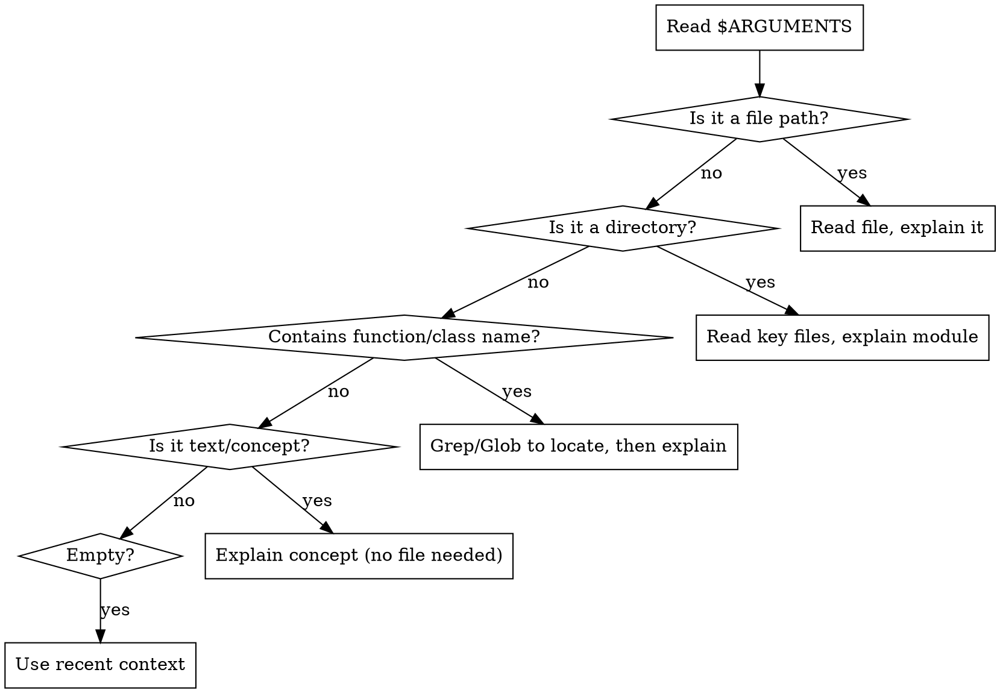

# Unpack

## Overview

Explain anything technical using **Layered Elaboration** -- start with intent, build a mental model, then walk through implementation. Based on Reigeluth's Elaboration Theory and Ausubel's Advance Organizers: scaffold understanding before details.

**Core rule:** Never start with the walkthrough. The most common explanation failure is jumping straight into implementation.

## Argument Parsing

Parse `$ARGUMENTS` in this order:

**Examples:**
- `/unpack src/auth/middleware.ts` -- file path
- `/unpack src/auth/` -- directory/module
- `/unpack "the retry logic in handleRequest"` -- concept in codebase
- `/unpack kubernetes ingress` -- general technical concept
- `/unpack` -- explain last code/topic in conversation

## Depth Control

Depth can be set via explicit flags OR inferred from natural language. Scan both `$ARGUMENTS` and the user's full message.

### Explicit Flags (in $ARGUMENTS)

| Flag | Layers |
|------|--------|
| `--brief` or `--tldr` | 1 only |
| `--shallow` | 1 + 2 |
| `--deep` | 1 + 2 + 3 + 4 (Layer 4 expanded) |
| *(none)* | 1 + 2 + 3 (Layer 4 offered) |

### Natural Language Inference

If no explicit flag, infer depth from the user's phrasing:

| User language | Inferred depth | Equivalent |
|---------------|----------------|------------|
| "briefly", "quick", "tldr", "tl;dr", "in a nutshell", "one-liner", "short version", "sum it up" | Layer 1 only | `--tldr` |
| "high level", "overview", "big picture", "gist", "broad strokes", "at a glance" | Layers 1 + 2 | `--shallow` |
| "in detail", "deep dive", "thoroughly", "everything", "all the nuances", "leave nothing out" | All 4 layers, Layer 4 expanded | `--deep` |
| "explain", "how does X work", "walk me through", "what does this do", "teach me", "break down" | Layers 1 + 2 + 3, Layer 4 offered | *(default)* |

When language conflicts with a flag, the explicit flag wins.

## The Four Layers

### Layer 1 -- Intent (1-2 sentences)

What does this thing do and why does it exist? Zero implementation details. A smart non-technical person should understand this.

**For code/files:** State where it fits in the broader system before anything else.

### Layer 2 -- Mental Model (short paragraph or ASCII diagram)

A simplified analogy, metaphor, or diagram showing how the parts relate. This is the scaffold -- name the key components and show their relationships. Prefer spatial/visual representations.

### Layer 3 -- Walkthrough (the main explanation)

Step through the actual implementation or mechanism:
- **Constantly map back** to the mental model from Layer 2
- **Highlight** what's important vs what's incidental
- **For code:** show relevant code inline within the walkthrough, not as a separate block before the explanation
- Use concrete examples over abstract descriptions

### Layer 4 -- Edge Cases & Nuance (optional, offer to expand)

Failure modes, tradeoffs, gotchas, common misconceptions, performance characteristics. Don't dump this unless `--deep` is set or there's a critical gotcha the user must know.

## Complexity Assessment

Before starting, assess complexity:

- **Simple** (a utility function, a config file, a basic concept): Layers 1 + 3 may suffice. Don't force a mental model diagram onto something that doesn't need one.
- **Moderate** (a module, an algorithm, a protocol): All layers in order.
- **Complex** (a system, an architecture, cross-cutting concerns): All 4 layers, Layer 2 is critical. Consider multiple diagrams.

## Closing

Always end with: **"Want me to go deeper on any part of this?"**
